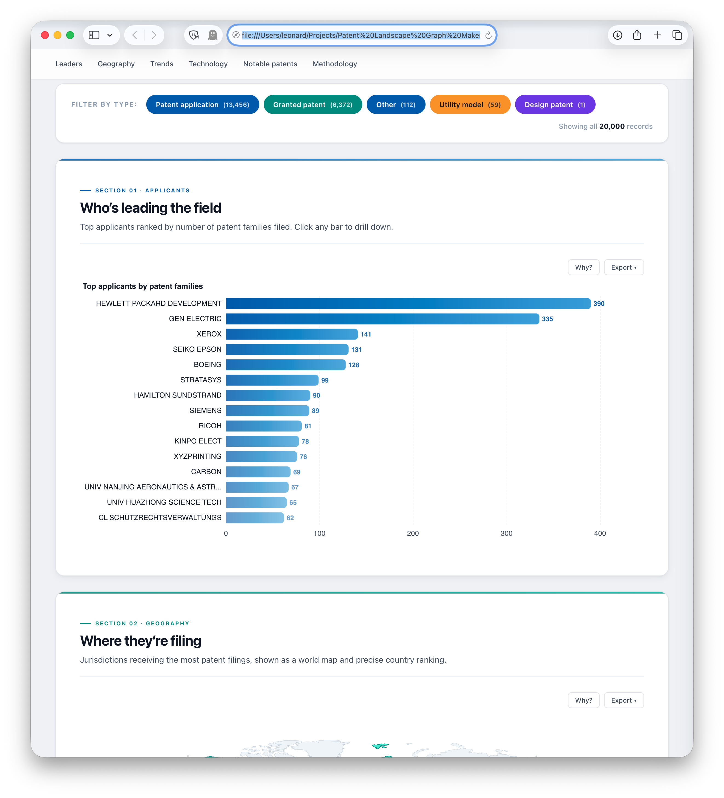
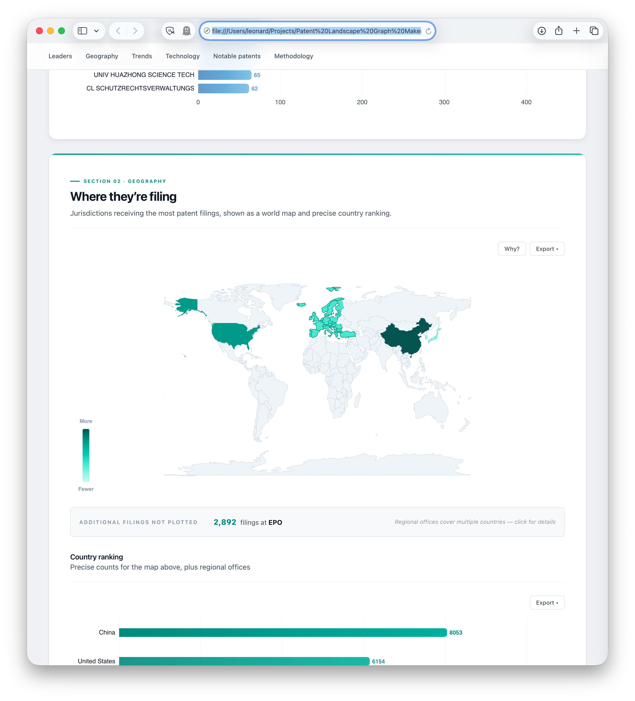
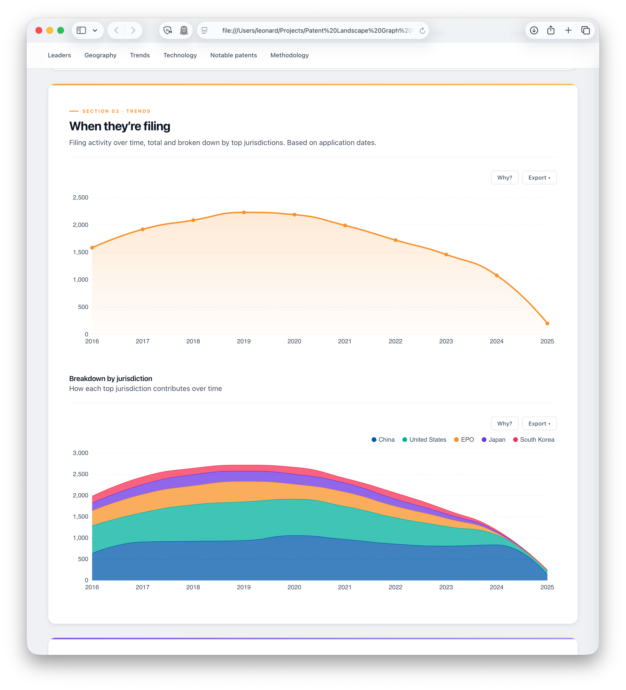
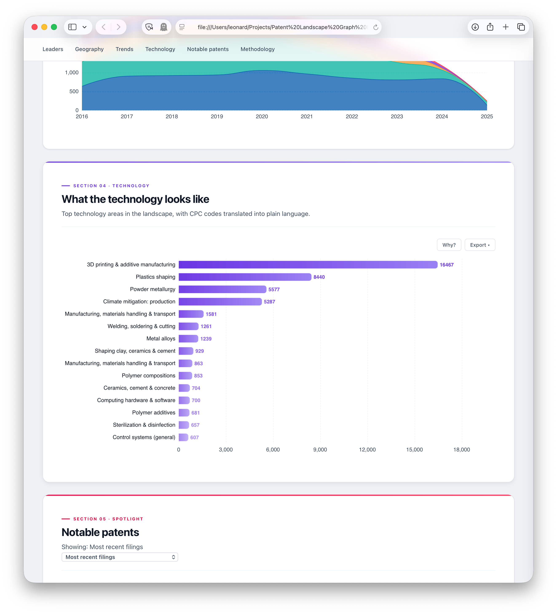
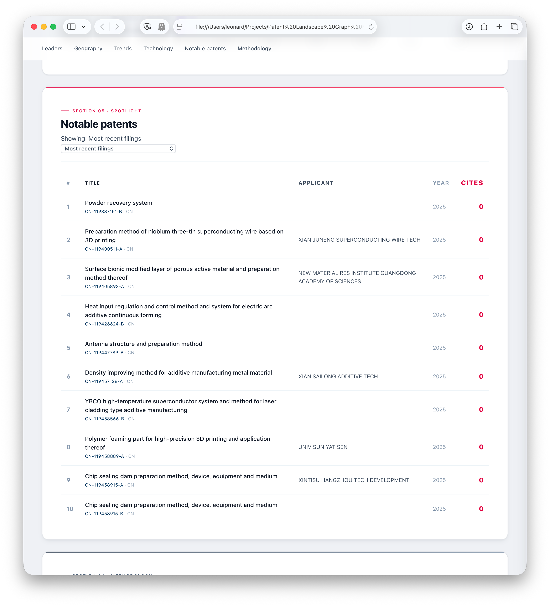
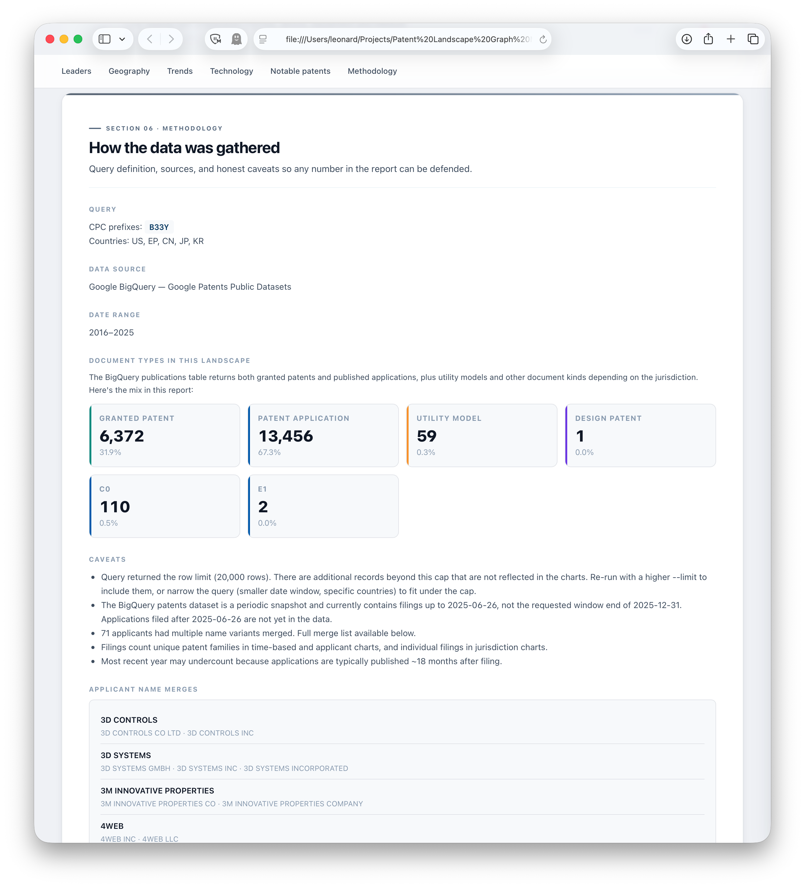

# Claude Skill for Patent Landscape Analysis

A Claude Code skill that produces decision-grade patent landscape reports as
self-contained interactive HTML files. Describe a technology area in natural
language — the skill pulls the relevant patent data from Google Patents
BigQuery, runs the analytics, and writes a single `.html` file you can share
with stakeholders. The file opens offline, stays interactive forever, and
every number in it has receipts.


## What you get

Every report is a single `.html` file — no server, no runtime, no network once
it's rendered. The reader opens it in any browser and sees:

- **A plain-language headline** with four colored stat tiles (patent families,
  distinct applicants, jurisdictions, peak filing year). The target reader is
  someone who doesn't know what a CPC class is — a non-specialist reviewer,
  not a patent attorney — so every term is translated. The summary is a
  bulleted list with no run-on sentences.
- **A leaderboard of the top applicants**, ranked by unique patent families
  filed. Names are normalized so `Samsung SDI Co., Ltd.`, `Samsung SDI
  Corp.`, `Samsung SDI Company Limited`, and Cyrillic/Japanese/Korean/Chinese
  variants all collapse into one entity. The normalizer strips 100+ legal
  suffixes across multiple languages and applies a hand-curated alias table.
  Every merge is disclosed in the Methodology section so any normalization
  can be defended.
- **A world map with an EPC member-state overlay** showing where applicants
  are actually filing. European Patent Office filings are handled honestly:
  EPC member states visible on the 1:110m world map (33 of the 38 total —
  Liechtenstein, Monaco, San Marino, Malta, and Cyprus are too small at this
  scale) are shaded in a distinct teal tone, while direct national filings
  show up on the filings-intensity color ramp. EP and WIPO/PCT get their own
  footnote below the map so nothing is falsely attributed to a specific
  country. Clicking any European country opens the EPO drill-down.
- **Filing trends over time**, both in aggregate and broken down by
  jurisdiction as a stacked area chart. All time axes use **application date**
  (not publication date), matching the standard patent-landscape methodology.
  Snapshot-lag and publication-lag artifacts are detected automatically: the
  trend narrative excludes trailing partial years so you never ship a report
  reading "filings fell 87%" when the real story is "2025 is a half-year of
  data still subject to the 18-month publication lag."
- **A technology-area breakdown** where every CPC class is translated into
  plain English — `G06N` → "AI, machine learning & computing models",
  `B33Y` → "3D printing & additive manufacturing", `A61K` → "Medical, dental
  & cosmetic preparations". The count reflects *how many distinct patent
  families touch that class*, not how many times the code appears in the
  data (a single patent usually carries 5–20 CPC codes, and conflating the
  two makes the chart meaningless).
- **A notable-patents spotlight** with a dropdown of four views — most
  recent filings (default), top applicants' newest patents, foundational
  patents (earliest in the window), and cross-disciplinary patents (those
  spanning the most CPC subclasses). Switching the dropdown recomputes the
  table client-side; the view honors any active document-type filter.
- **A methodology section** with the exact query (plain-language + CPC
  codes), data source, date range, effective date span, a document-type
  breakdown showing patents vs applications vs utility models vs other, and
  caveats (row-cap truncation, snapshot freshness, publication lag,
  applicant merges, missing fields). Everything the report author needs to
  defend a number if a reader questions it.

Every chart has its own PNG and SVG export button (top-right of the card).
The whole report downloads as a re-emailable HTML copy, an underlying-data
CSV, or a printable PDF via the **Download** dropdown in the hero.

## Section gallery

**Interactive filter bar + Who's leading the field** — filter pills at the top toggle document types (Patent application, Granted patent, Utility model, Design patent, Other). All metrics and charts recompute client-side when you click a pill. Below: applicants ranked by unique patent families filed. Click any bar for a drill-down grouped by applicant with each patent linking out to Google Patents.



**Where they're filing** — world map with a two-layer color scheme: brighter teal for the 38 EPC member states (covered by EPO filings), a darker teal ramp for countries with direct national filings. The hovered country's tooltip shows context-appropriate information (direct filing count + share, or "EPC member state — covered by X EPO filings"). The map footnote accounts for regional offices (EPO, WIPO/PCT) that can't honestly be plotted on a country map. A precise country ranking sits below with its own gradient bar chart.



**When they're filing** — total filings per year as an amber area chart, and a stacked breakdown by top jurisdictions (blue, teal, amber, violet, rose). The trend narrative in the headline is computed with a trailing-year exclusion heuristic: any year whose count is less than 50% of the median of earlier years is flagged as "likely incomplete" and excluded from the start→end comparison, with the exclusion disclosed in plain language ("2025 excluded as incomplete — snapshot or publication lag").



**What the technology looks like** — top CPC subclasses translated into plain English, in a violet gradient bar chart. The reference map covers 250+ classes and falls back gracefully to the CPC section description for codes not explicitly listed. The Notable Patents Spotlight section is visible at the bottom with its dropdown selector.



**Notable patents with Spotlight dropdown** — four switchable views: Most recent filings (default), Top applicants' newest patents, Foundational patents (earliest), and Cross-disciplinary (most CPC subclasses). The dropdown dynamically recomputes the table when switched. Each patent links to Google Patents with the correct URL format (including the US application zero-padding fix).



**How the data was gathered** — the Methodology section shows the exact query (CPC codes, date range, jurisdictions), data source, a document-type breakdown with colored pills (Granted patent, Patent application, Utility model, Design patent, Other), caveats, and the full applicant name-merge audit trail.



## How it's used

You run it from a chat with Claude Code:

> "Build me a patent landscape report on 3D printing and additive
> manufacturing, 2016–2025, top five jurisdictions."

Claude reads `SKILL.md`, picks the right entry point, runs a parameterized
BigQuery against Google Patents, normalizes the records, runs the analytics,
writes a report to `./reports/`, and returns a short Markdown headline you
can read inline plus a file path you double-click to open.

You can also drive it from the command line:

```bash
# Search Google Patents BigQuery
python3 skill/scripts/landscape_builder.py search \
  --cpc B33Y \
  --from-to 2016-01-01 2025-12-31 \
  --country US --country EP --country CN --country JP --country KR \
  --label "3D printing & additive manufacturing"

# Or build from a pre-collected Lens.org CSV
python3 skill/scripts/landscape_builder.py csv path/to/lens-export.csv

# Or fetch USPTO file histories for specific US patents
python3 skill/scripts/landscape_builder.py history US11000000 US11000001
```

`--max-gb` raises the BigQuery scan cost ceiling for broad worldwide searches.
`--months N` and `--years N` are shortcuts for trailing-window queries.

## Setup

```bash
git clone https://github.com/LeonardHope/Claude-Skill-for-Patent-Landscape-Analysis.git
cd Claude-Skill-for-Patent-Landscape-Analysis
python3 skill/get_started.py
```

`get_started.py` checks:

- Python 3.9+
- `jinja2` and `google-cloud-bigquery` Python packages
- The `google-patent-search` skill is installed at
  `~/.claude/skills/google-patent-search/` (for BigQuery mode)
- Vendor assets (`echarts.min.js` ~1 MB, `world.geo.json` ~250 KB) are
  downloaded to `skill/vendor/` — these are too large to track in git, so
  the script re-downloads from pinned URLs on first run
- A symlink from `~/.claude/skills/patent-landscape-report/` to this repo so
  Claude Code discovers the skill globally

BigQuery mode additionally requires `gcloud auth application-default login`.
CSV mode works without any cloud credentials.

## Data sources

| Source | Role |
|---|---|
| **Google Patents Public Datasets** (BigQuery) | Primary international coverage. 17+ countries, metadata + CPC + assignees + family IDs. Queries are cost-gated and dry-run first. Typical landscape runs 5–40 GB scanned (well under the 1 TB/month free tier). |
| **Lens.org CSV export** | Alternative input for pre-curated landscapes. Same analytics path, same report output. Works offline. |
| **USPTO Open Data Portal** (via `uspto-patent-search` skill) | Optional. The `history` subcommand wraps this skill to download file wrapper PDFs for specific US patents. Other USPTO features (prosecution analytics, PTAB, assignment chain, legal status) aren't integrated — invoke the `uspto-patent-search` skill directly for those. |

The two data-fetcher modules (`data_fetcher_bigquery.py` and
`data_fetcher_csv.py`) both emit the same canonical `PatentRecord` schema, so
analytics and rendering are source-agnostic.

## Design principles

1. **Receipts on every number.** Every metric in the report is computed with
   a `Metric` object that carries its formula, source records, caveats, and
   sensitivity notes. The reader clicks "Why?" on any stat and sees exactly
   how it was derived — plain-English formula, quantitative breakdown, the
   list of specific patents that contributed (clickable to Google Patents),
   caveats, and "what would change this number" sensitivity notes. The goal:
   any reader should be able to trace any number back to its underlying
   patents in one click.

2. **Plain language by default.** No CPC codes naked, no jurisdiction codes
   unexplained, no "priority date" without a translation. Every term the
   reader might stumble on has a plain-English definition available on
   hover. The default view reads like prose; the technical detail is an
   opt-in drill-down away. Translation references live in
   `skill/references/*.json`:
   - `cpc_plain_english.json` — 230+ CPC subclasses with human labels
   - `jurisdiction_names.json` — ISO codes to country names + regional-office
     metadata (EPO covers 38 EPC member states, WIPO/PCT is a filing route
     not a destination, etc.)
   - `applicant_aliases.json` — hand-curated alias table that grows over time

3. **Honest about what the data doesn't say.** Multiple layers of automatic
   honesty:
   - **Trend narrative**: a trailing-year exclusion heuristic detects
     partial years and drops them from the growth calculation with an
     explicit "excluded as incomplete" note.
   - **Truncation warning**: when a BigQuery query hits its row cap, the
     report's headline and Methodology sections both prominently disclose
     that more records exist beyond the cap.
   - **Snapshot freshness**: the report detects the latest actual filing
     date in the returned data and compares it to the requested window end,
     flagging the delta.
   - **Applicant merges**: every normalized entity lists the raw name
     variants that collapsed into it, so the report author can defend
     the merges if a reader questions them.
   - **Document type breakdown**: the Methodology section shows the mix of
     granted patents vs published applications vs utility models vs other,
     so the reader understands that "16,467 patent families" in a Chinese-
     heavy landscape is dominated by utility models (weaker than invention
     patents) rather than granted inventions.

4. **One file, offline forever.** The deliverable is a single `.html` file
   with everything inlined: ECharts (~1 MB), world GeoJSON (~250 KB),
   report data as JSON, CSS, JS. No CDN, no server, no runtime. Email it,
   archive it to a matter, stash it in a project folder — it opens in any
   browser, works offline, and stays interactive. The self-contained-HTML
   pattern was chosen over a live web app because a landscape snapshot is
   more useful as an archivable artifact than as a view onto a running
   service with uncertain longevity.

5. **Application date is the time axis.** Every chart and aggregate uses
   application date (with fallbacks to earliest priority date, then
   publication date). Publication date is never used as the primary time
   axis because applications are published ~18 months after filing, which
   systematically misrepresents current activity. This matches how the
   patent-landscape profession counts filings.

## Architecture notes

- **`PatentRecord`** is the canonical schema. Both fetchers normalize to it;
  analytics and rendering are source-agnostic.
- **`Metric` + `ReportBundle`** are the provenance primitives. Every metric
  carries its formula and source record IDs; the renderer serializes them
  for the in-report receipts panel.
- **Counting strategy** varies by chart:
  - Headline aggregates, top applicants, filing trends, and technology areas
    count **unique patent families** (family deduplication via
    `select_family_representatives`) so an invention filed in US+EP+CN is
    counted once, not three times.
  - Jurisdiction distribution counts **individual filings** — each national
    filing is a distinct data point for geographic-coverage purposes.
  - This distinction is documented in the Methodology section.
- **HTML size**: all records are embedded with abbreviated single-character
  JSON keys (`p`, `t`, `j`, `y`, `k`, `f`, `a`, `c`, `ci`, `u`) so the
  client-side document-type filter can recompute every metric without
  re-querying. A 20,000-record landscape produces roughly a 7 MB HTML file
  — comfortably under typical email attachment limits.
- **URL construction** for Google Patents links handles the US zero-padding
  quirk: BigQuery stores US applications as 10-digit compressed form
  (`US-2025229339-A1`), but Google Patents canonical URLs use the 11-digit
  form (`US20250229339A1`). The renderer rebuilds URLs from publication
  numbers at render time, so the fix applies retroactively to old cached
  record sets.

## Roadmap

- **Applicant alias table growth**: the `applicant_aliases.json` starts
  empty and grows as real reports surface cross-language / cross-entity
  merges worth curating.
- **More spotlight views** (broadest geographic protection, emerging
  applicants, acceleration leaders).
- **Deployable variant** of the skill (remains a future consideration —
  current architecture is local-first by design).

## Repository layout

```
skill/
  SKILL.md                 # routing brain — Claude reads this to decide when to fire
  get_started.py           # one-time setup verification + vendor download
  scripts/
    landscape_builder.py   # orchestrator + CLI entry point (search | csv | history)
    data_fetcher_bigquery.py
    data_fetcher_csv.py
    data_layer.py          # canonical PatentRecord schema + family helpers
    analytics.py           # metric computations with provenance
    provenance.py          # Metric / ReportBundle data classes
    applicant_normalizer.py  # legal-suffix stripping + alias table
    plain_language.py      # CPC + jurisdiction + term translators + trend narrative
    html_renderer.py       # fills the Jinja2 template, inlines vendor assets
  templates/
    report.html.jinja      # the deliverable template (CSS + JS + markup)
  vendor/
    echarts.min.js         # bundled at run time (not in git)
    world.geo.json         # bundled at run time (not in git)
  references/
    cpc_plain_english.json   # 250+ CPC subclasses translated to plain English
    jurisdiction_names.json  # ISO codes + regional-office metadata
    applicant_aliases.json   # hand-curated entity normalization

reports/                   # output directory for generated .html reports
                           # (created on first run, gitignored)
docs/screenshots/          # README images
```

## Status

Usable end-to-end against real Google Patents BigQuery data. The report
generation pipeline, receipts, drill-downs, EPC map overlay, and interactive
document-type filter have all been verified on real landscape queries. Active
development continues on normalization coverage and additional spotlight views.

## License

MIT. See [LICENSE](LICENSE).

## Credits

Builds on two upstream Claude skills:

- [`google-patent-search`](https://github.com/LeonardHope/Google-Patents-Natural-Language-API-Search) —
  wraps the Google Patents Public Datasets on BigQuery. Provides authentication,
  cost-gating dry runs, and a BigQuery client that `data_fetcher_bigquery.py`
  uses for landscape queries. **Required** for BigQuery mode.
- [`uspto-patent-search`](https://github.com/LeonardHope/USPTO-MyODP-and-PatentsView-Natural-Language-API-Search) —
  wraps the USPTO Open Data Portal APIs. **Optional** — used only by the
  `history` subcommand to download file wrappers for specific US patents.

Charts are rendered with [Apache ECharts](https://echarts.apache.org/). The
world map uses the [Natural Earth](https://www.naturalearthdata.com/) 1:110m
country boundaries, accessed via [`world.geo.json`](https://github.com/johan/world.geo.json).
